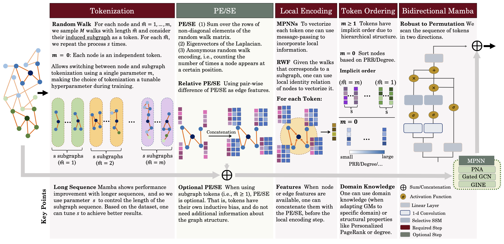

# Graph Mamba: Towards Learning on Graphs with State Space Models

[](https://arxiv.org/abs/2402.08678)


### <ins>Codes and models will be available soon (Feb 20)</ins>.





## Citation

If you find this work useful, please cite our paper:
```bibtex
@article{behrouz2024GMN,
  title={{Graph Mamba: Towards Learning on Graphs with State Space Models}}, 
  author={Ali Behrouz and Farnoosh Hashemi},
  year={2024},
  eprint={2402.08678},
  archivePrefix={arXiv},
  primaryClass={cs.LG}
}
```
